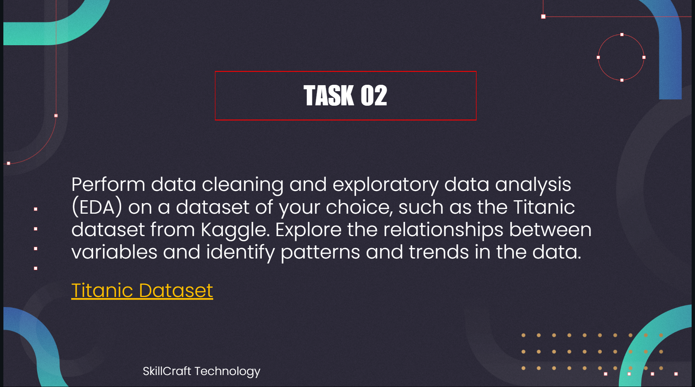

# SKILLCRAFT_DS_02

#  SkillCraft Technology – Data Science Internship (Task 2)

Hi there!  
I'm ** VASUDEVAN **, and this repository showcases my submission for **Task 2** of the **Prodigy Infotech Data Science Internship**. In this task, I performed **Data Cleaning**, **Exploratory Data Analysis (EDA)**, and **Machine Learning Modeling** on the famous Titanic dataset to uncover trends and build a predictive model.

---

## 🌍 About the Dataset

I worked with the [**Titanic Dataset**](https://www.kaggle.com/c/titanic/data), which contains information about passengers aboard the RMS Titanic. Some of the key features in the dataset include:

- PassengerId  
- Survived (target variable)  
- Pclass (ticket class)  
- Name  
- Sex  
- Age  
- SibSp (siblings/spouses aboard)  
- Parch (parents/children aboard)  
- Fare  
- Embarked (port of embarkation)  
... and more!

---

## 🧰 Tools & Libraries

This project was completed using Python in a Jupyter Notebook environment, with the help of:

- `pandas` and `numpy` for handling and cleaning data  
- `matplotlib` and `seaborn` for visualizations  
- `scikit-learn` for building and evaluating ML models  
- Jupyter Notebook for coding and presenting the analysis  

---

## 🔍 What I Did – A Quick Walkthrough

### 1. **Getting to Know the Data**
- Loaded the dataset using `pandas`  
- Explored data structure and column types  
- Identified missing values and nulls

### 2. **Cleaning Things Up**
- Dropped irrelevant columns like `Ticket` and `Cabin`  
- Filled missing values in `Age` and `Embarked`  
- Converted categorical columns for model readiness

### 3. **Let’s Visualize!**
Created a series of insightful visualizations:

- Bar plots and pie charts for survival distribution  
- Count plots to compare `Sex`, `Pclass`, and `Embarked` vs `Survived`  
- Histograms and boxplots to explore `Age`, `Fare`, and `Parch`  
- Correlation heatmap to understand numerical feature relationships  

### 4. **Modeling & Evaluation**
Trained and compared multiple classification models:

- **Logistic Regression**  
- **Support Vector Machine (SVM)**  
- **Naive Bayes**  
- **K-Nearest Neighbors (KNN)**  
- **Decision Tree**

Evaluated them using accuracy scores and confusion matrices.

---

## 💡 Key Takeaways

- **Gender Matters**: Females had a higher survival rate than males.  
- **Class Counts**: Passengers in 1st class had significantly better survival chances.  
- **Embarkation Point**: Passengers from Cherbourg (C) had higher survival rates.  
- **Top Model**: Naive Bayes performed best among the models tested.

---

## 📊 Model Performance Summary

| Model                   | Accuracy Score |
|-------------------------|----------------|
| Naive Bayes             | 0.76           |
| Logistic Regression     | 0.75           |
| Decision Tree           | 0.74           |
| Support Vector Machines | 0.66           |
| K-Nearest Neighbors     | 0.66           |

---

## 🎯 Conclusion

This task was a great exercise in cleaning real-world data, exploring relationships using EDA, and applying various classification algorithms to make predictions. It reinforced the importance of preprocessing and model comparison in data science workflows.
---

Thanks for stopping by and reviewing my work! 😊
